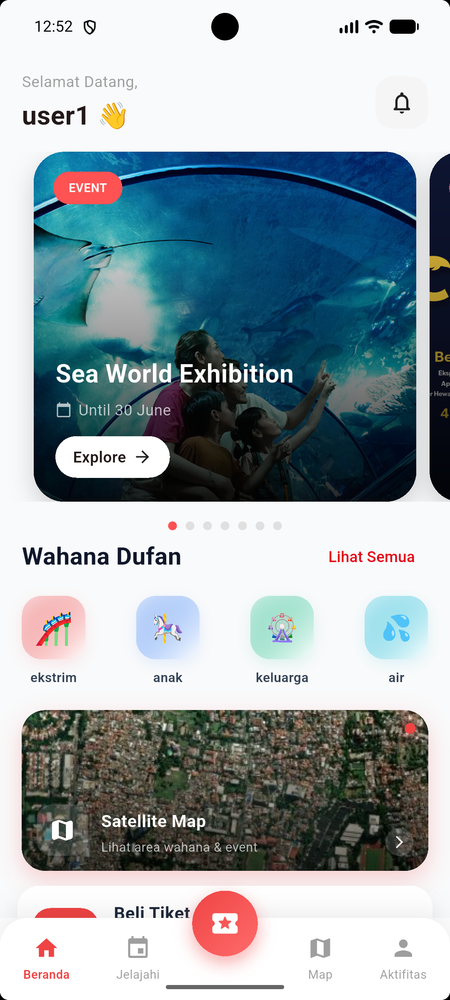
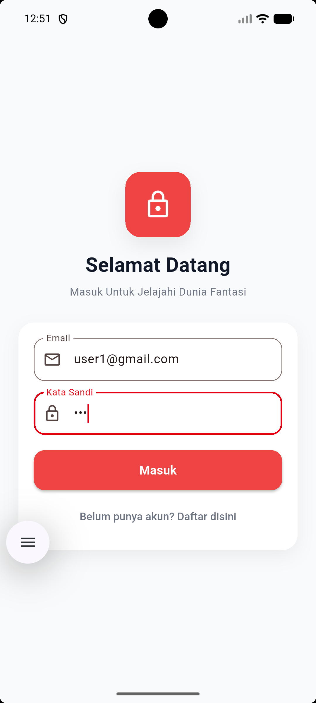
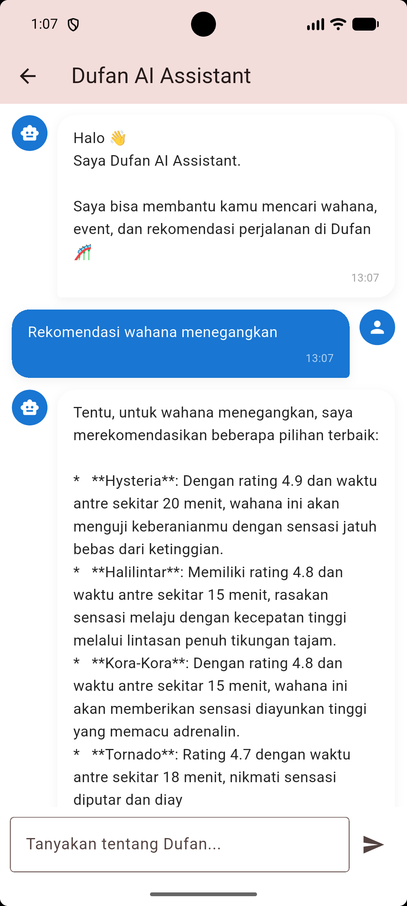
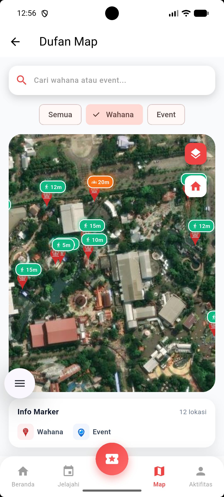
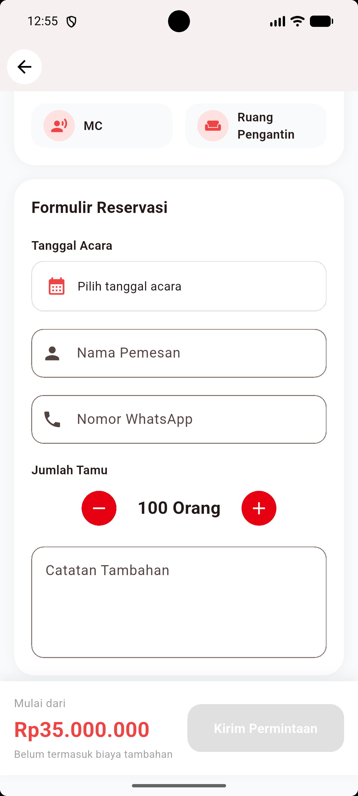
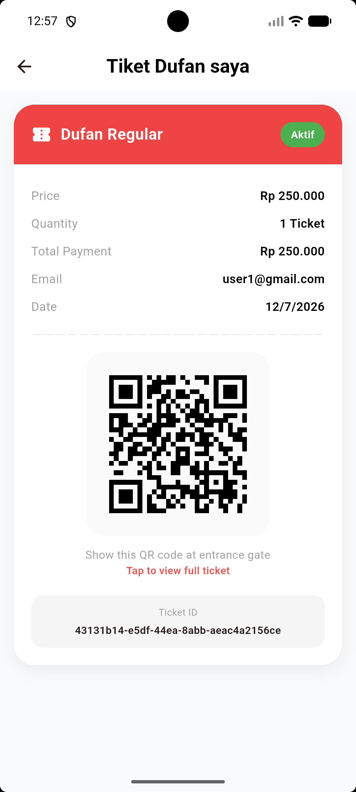
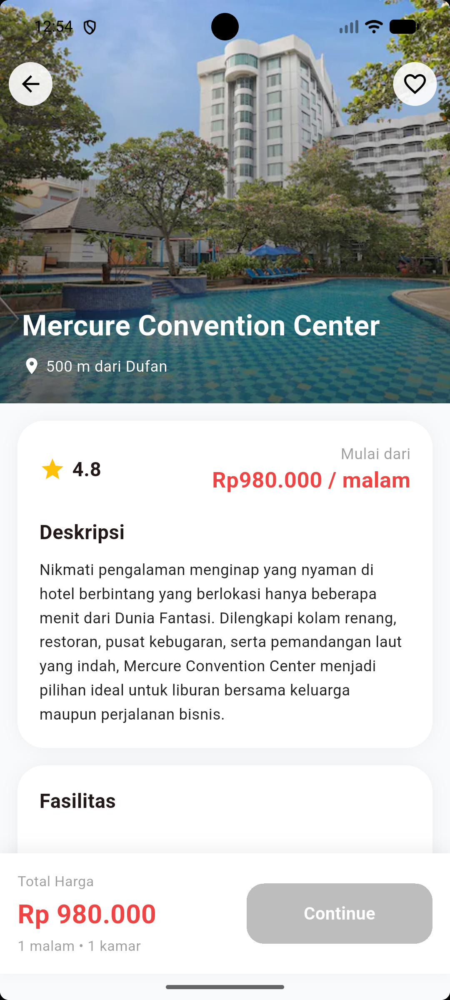
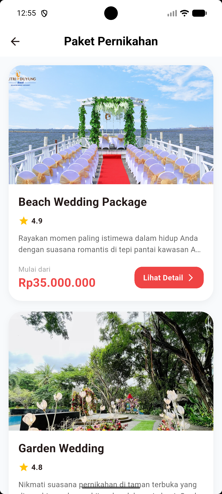
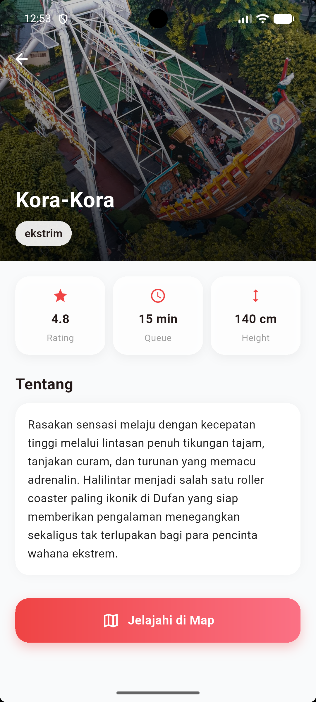
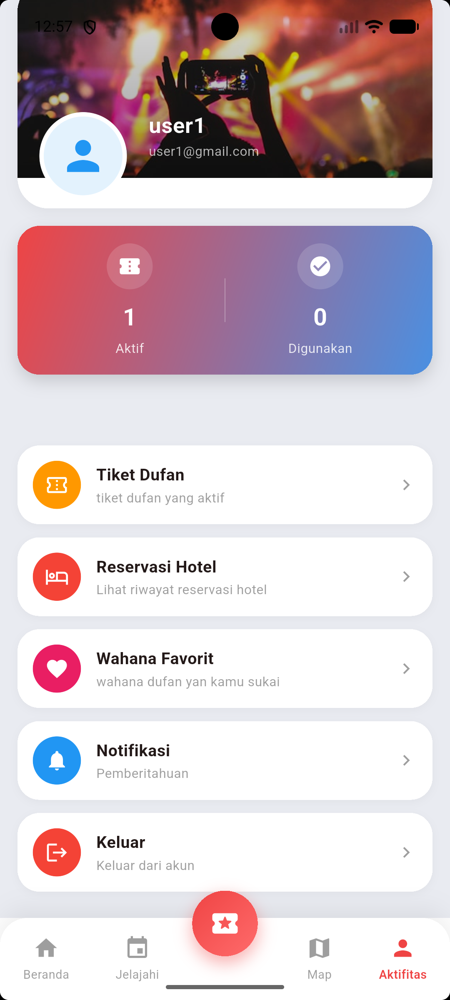

# Dufan Mobile App

A Flutter-based mobile application for Dufan featuring ticket reservations, hotel booking, wedding reservations, interactive maps, QR tickets, and an AI assistant powered by Gemini API.

# Features

- User Authentication (Login & Register)
- Attraction & Event Information
- Ticket Reservation
- Hotel Booking
- Wedding Reservation
- QR Code Ticket
- Interactive Map
- AI Assistant (Gemini API)
- Ticket History

# Tech Stack

- Flutter
- Dart
- Hive
- SharedPreferences
- Flutter Map
- Gemini API
- Figma

# Screenshots

| Home                      | Login                      |
| ------------------------- | -------------------------- |
|  |  |

| AI Assistant                      | Map                                 |
| --------------------------------- | ----------------------------------- |
|  |  |

| Ticket                         | History                            |
| ------------------------------ | ---------------------------------- |
|  |  |

| Hotel                              | Wedding                                   |
| ---------------------------------- | ----------------------------------------- |
|  |  |

| Attraction                         | Profile                     |
| ---------------------------------- | --------------------------- |
|  |  |

# Getting Started

```bash
git clone https://github.com/USERNAME/dufan-mobile-app.git

cd dufan-mobile-app

flutter pub get

flutter run

## API Key

This project requires a Gemini API key.

Replace `YOUR_API_KEY` in `gemini_service.dart` with your own API key before running the application.
```

# Project Structure

```
lib/
├── core/
├── data/
├── models/
├── pages/
├── services/
├── widgets/
└── main.dart
```

# Author

**Marcelo Dede Saputra**
